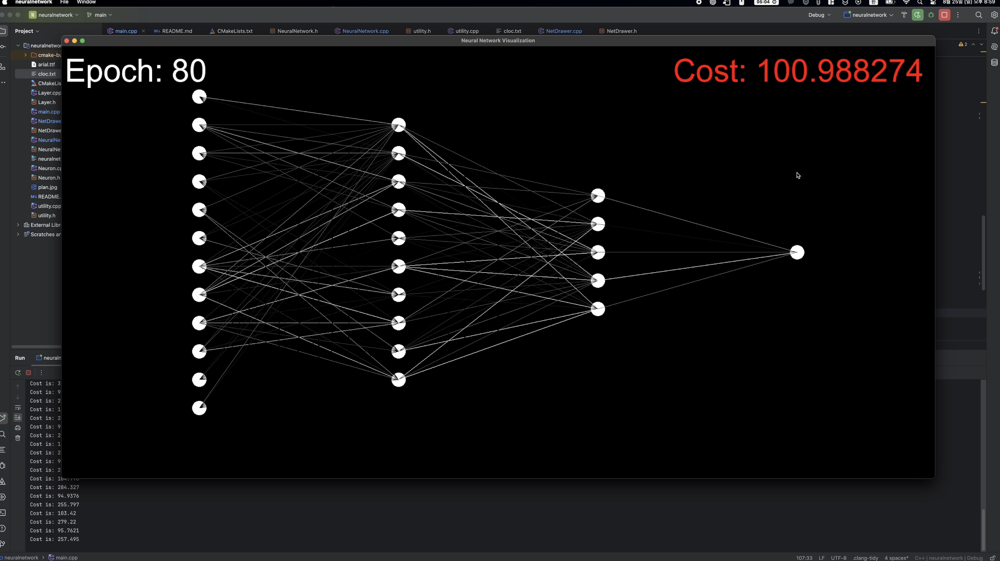
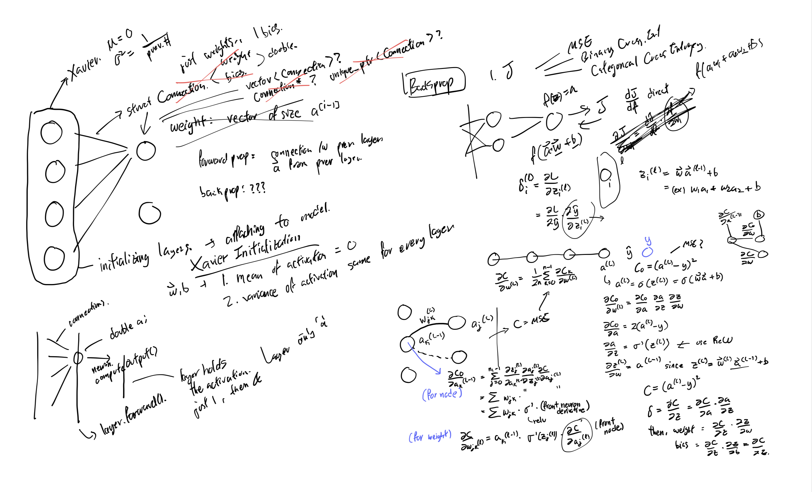

## Implementation

(click to see the video)  

Implementing neural network in C++. Benchmarked way how we use Keras: you can create models, add layers, specify learning rate, use different activations (RELU, SIGMOID, TANH, LINEAR, SOFTMAX), use different cost functions (MSE, BinaryCrossEntropy, CategoricalCrossEntropy), and choose among Stochastic Gradient Descent, Mini-Batch, and Batch.

I'm using element wise backpropagation (not matrix backprop). There are lots of inefficiencies in my code.
## References:

- [Weight/bias Xavier initialization](https://www.deeplearning.ai/ai-notes/initialization/index.html#:~:text=Initializing%20all%20the%20weights%20with,the%20same%20features%20during%20training)
- [He Weight Initialization](https://machinelearningmastery.com/weight-initialization-for-deep-learning-neural-networks/)
- [Backpropgation in neural network](https://builtin.com/machine-learning/backpropagation-neural-network)
- [Backpropagation Calculus](https://www.youtube.com/watch?v=tIeHLnjs5U8)
- [Backpropagation Calculus](https://brilliant.org/wiki/backpropagation/)
